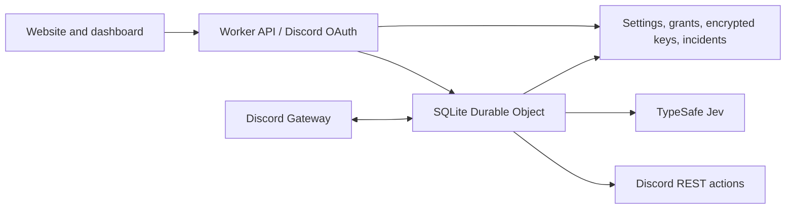

# JevBot

**Keep the conversation. Clear the spam.**

An open-source Discord moderation bot with Jev contextual checks, deterministic spam rules, and an allowlisted Discord OAuth dashboard. Website: [jevbot.zamasu.dev](https://jevbot.zamasu.dev).

## What it does

- Observe, Gentle, Balanced, Strict, and Custom policies, including channel overrides.
- Flood, normalized duplicate, mass mention, and blocked domain checks.
- Contextual classification through [TypeSafe's Jev API](https://docs.typesafe.ai/introduction/quickstart).
- Per-server encrypted API keys, daily and minute request caps, and a message tester.
- Owner-approved administrators and reviewers. Discord sign-in alone never grants access.
- Incident review, audit history, configurable retention, and connection diagnostics.
- Warnings, deletion, and strike-based timeouts. No automatic bans.

New servers start in **Observe**. Enable enforcement after reviewing actual detections. Low-confidence results go to review. Provider failures leave ordinary messages alone; deterministic rules remain available.

## Architecture



React/Vite assets are served by Cloudflare Workers Static Assets. The API is Hono on Workers. One SQLite Durable Object maintains the outbound Discord Gateway connection, heartbeat, resume state, recent context, and deduplication. Alarms and a five-minute cron provide recovery and expiry cleanup.

## Deploy your own instance

Requires Node.js 24+, a Cloudflare account, a domain zone in that account, a Discord application, and a TypeSafe API key for AI checks.

1. Clone the repository and run `npm ci`.
2. Copy `wrangler.example.jsonc` to `wrangler.jsonc`. Set your Cloudflare account ID, custom domain, `APP_ORIGIN`, Discord application ID, owner Discord user ID, and source URL. The application origin must exactly match the public HTTPS origin, with no trailing slash.
3. Run `npx wrangler login`, then `npx wrangler d1 create jevbot`. Put the returned database ID in the `DB` binding.
4. Create your Discord application at the [Developer Portal](https://discord.com/developers/applications). Configure the OAuth redirect as `https://YOUR-DOMAIN/auth/callback`. Enable **Message Content Intent** on its Bot page. Keep the OAuth client secret and bot token private.
5. Run `npm run db:remote`, followed by `npm run deploy`. This deploys directly to the custom domain, with Workers development URLs and preview URLs disabled.
6. Run `npm run secrets` in your own terminal. Enter the OAuth client secret and bot token into its hidden prompts. It generates the master encryption secret only when none exists, uploads credentials to your Worker using Wrangler, and saves a private encryption backup in ignored `.local/`.
7. Sign in at `/admin` as the configured owner. Invite the bot to a server through **Bot status**, place its role above users it should moderate, start the connection, and refresh the server list.
8. Save your TypeSafe key under **API key & usage**. Run a Jev check in **Message tester**, set request caps, and review Observe incidents before selecting an enforcing policy. Approve other user IDs under **Admin access**.

Only `identify` is requested for dashboard login. Bot installation requests View Channels, Send Messages, Manage Messages, Read Message History, and Moderate Members. Administrator permission is not requested. Discord role hierarchy still applies, and refused actions appear as failures in incident history.

The committed `wrangler.jsonc` is the zamasu.dev deployment configuration. Use the example for your own account. IDs and domain names are public configuration; credentials belong in secrets.

## Local development and checks

```sh
npm ci
npm run types
npm run db:local
npm run dev
```

Open `http://127.0.0.1:8787`. For local OAuth, copy `.dev.vars.example` to `.dev.vars`, supply your own credentials, and register `http://127.0.0.1:8787/auth/callback` in Discord. Local sessions and keys use the local database. Never connect local and deployed copies of the bot simultaneously using the same token.

Use `npm run dev:web` for frontend hot reload while Wrangler serves the API. `npm run check` runs TypeScript, tests in the Workers runtime, and the production build. Tests use dummy credentials and local storage, never live Discord actions or paid inference.

## Hosting and costs

The website and API target Cloudflare's free quotas. A persistent outbound Gateway WebSocket cannot use Durable Object WebSocket hibernation. One active 128 MB object for 24 hours is approximately **10,800 GB-seconds/day**, compared with the current SQLite Durable Object free allowance of **13,000 GB-seconds/day**, shared across your account. Message volume, D1 writes, other objects, and AI provider charges also matter. Check [Cloudflare's current pricing](https://developers.cloudflare.com/durable-objects/platform/pricing/) and your actual account usage.

Treat the Gateway host as a small-server pilot until a live reconnect test and a 24-hour usage test pass. No free-hosting guarantee is made. If continuous Gateway operation proves unreliable or exceeds quotas, an always-on VPS adapter is the next step; an Oracle adapter is not included in this release. Oracle Always Free availability depends on capacity and account eligibility.

## Data and operational limits

- Automatic trace storage and export are disabled because platform traces include full request URLs, including OAuth callback codes. Structured application error logs remain enabled and omit credentials and message content.
- Sessions expire after 24 hours and are invalidated when an owner revokes access. Grants and write permissions are checked on every request. Mutations require the correct Origin and CSRF token.
- API keys use AES-256-GCM with server ID as associated data. Stored plaintext is never returned through the dashboard API. Keep the master encryption key backed up; changing it makes existing saved keys unreadable.
- Gateway context expires after approximately two minutes, with a one-minute cleanup alarm. Up to three recent messages, capped at 500 characters each, may accompany the current message in an AI request. Deduplication fingerprints expire after 24 hours.
- Incidents store at most 500 characters, default to seven-day retention, and allow 1–30 days. Audit and usage history expire after 30 days. D1 cleanup runs every five minutes. Cloudflare backup retention is separate.
- Moderation work is serialized and bounded at 50 pending messages. Overload is reported in diagnostics. In-flight work can be interrupted by a runtime restart; persisted action intents expose uncertain outcomes, and deduplication reduces repeated actions. This is not an exactly-once message processor.
- Only message updates containing content, author, and member role data can be evaluated. Partial update events are skipped.
- Removing a provider key stops new checks, but a request already in flight may finish. Settings are rechecked before enforcement so changing or pausing a policy during inference cancels the action.

See the deployed [privacy page](https://jevbot.zamasu.dev/privacy) for the user-facing description.

## Contributing

Run `npm run check` before submitting a change. Do not include tokens, provider keys, personal message exports, `.dev.vars`, `.wrangler`, or `.local` in issues or commits. Report security issues privately through the repository owner's GitHub contact before public disclosure.

MIT licensed. JevBot is an independent community project.
